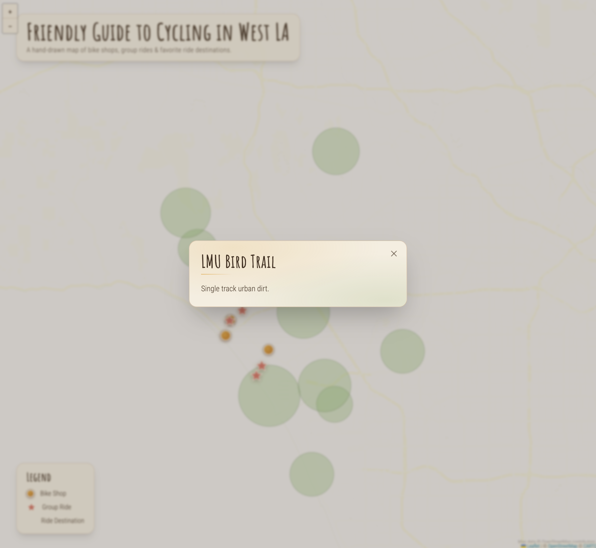

# Learnings

Compared vibecoding outputs across Claude Chat, v0, Loveable and Gemini.

**Claude** built the most responsive, most complete, most elegant webpage page with the least iterations. Without explicit prompting, Claude added the best secondary design details and most complete, descriptive, appealing UX copy.

All platforms struggled with:
1. Finding a usable interactive base map *(Open Street Map requires complicated dependencies, Claude found a good alternate CartoDB Voyager on its second attempt)*
2. Locating the markers on the map in their true correct location *(Required multiple follow up attempts and guidance)*
3. Sourcing the correct weblinks for shops and destinations *(Claude guessed for newer webpages that have less web history. Often a close but not quite accurate URL. Required manual correction.)*

Gemini, Google AI Studio tools were extremely opinionated, trying to drive the creation to remain in their visualization tools, instead of just directly generating an HTML file. Took multiple attempts to get an HTML file as output. Weirdly difficult for Google tools to use Google Fonts. Gemini also default to styling the base map closer to Google Maps, rather than the style I requested.

Original prompt length: ~3100 characters

## UI Learnings
Different tools had different opinions about where to locate popover overlays;some preferring a blocking, centered pattern vs in-context, near the opening interaction. 

I gave loose style input. Claude did the best at creating a hierarchical design system from sparse inputs.

* Title, Heading Font from Google Fonts
* Body Font from Google Fonts
* General colors and vibe description

##  Outputs

    
    
 Claude 

    
    
 Loveable 

    
    
 v0 Vercel 

    
    
 Gemini Chat, HTML 

    
    
 Google AI Studio 

